# 01 - Customizing VS Code

It's important to make your editor feel like your own. The more you feel like it's distinctly "yours", the more you will enjoy using it.

In this lab, you will learn...

- Themes
  - Changing the color theme
  - Installing new color themes
  - Customizing color themes
  - Creating Your Own color theme
  - Installing new icon themes
- Visual Tweaks
  - Show and hide the sidebar
  - Change the position of the sidebar
  - Hide the activity bar
  - Change the position of the terminal
  - Customize the title bar
- Fonts
  - Change the editor font
  - Install and use Font Ligatures
- Other
  - Use the Bracket Pair colorizer
  - Enabling breadcrumb navigation

## Themes

### Changing the color theme

1. Open the command pallete (Cmd/Ctrl + Shift + P) and type "theme".
1. Select a different theme

### Installing a new color theme

1. Open the command pallete (Cmd/Ctrl + Shift + P) and type "theme"
1. Select "Preferences: Color Theme"
1. Scroll down in the picker list to where it says "install new themes"
1. Install a new theme
   - Popular Light Themes: Hop Light, Atom Light
   - Popular Dark Themes: Night Owl, Cobalt2

### Customizing Color Themes

1. Open the User Settings (Cmd/Ctrl + ,)
1. On the left-hand side, expand "Workbench" and select "Appearance"
1. Under the second menu option, "Color Customizations", select "Edit in settings.json"
1. Open the "Color Customizations" object by typing the following...

   ```
   "workbench.colorCusotomizations"
   ```

   Select the item from the intellisense menu and notice that three settings are auto-added to the object...

   ```
   "workbench.colorCustomizations": {
     "statusBar.background": "#666666",
     "panel.background": "#555555",
     "sideBar.background": "#444444"
   }
   ```

   Experiment with different colors and see which items you can alter. Virtually everything in the editor can be changed. Check out [Adobe Color](https://color.adobe.com/create/color-wheel/) for some color inspiration.

   Check out [this doc](https://code.visualstudio.com/docs/getstarted/theme-color-reference?WT.mc_id=csstricks-themearticle-sdras) for a full list of all editor item names in VS Code and how to change their colors.

## Visual Tweaks

### Show/Hide Sidebar

1. The Sidebar visibility can be toggled with Cmd/Ctrl + B. Practice this. You will use it A LOT.

### Change Sidebar Location

The sidebar position can be changed, and moving it to the right-hand side can lessen cognitive disruption when expanding and collapsing.

1. Open the Command Palette (Ctrl/Cmd + Shift + P) and select "Toggle Side Bar Position"
   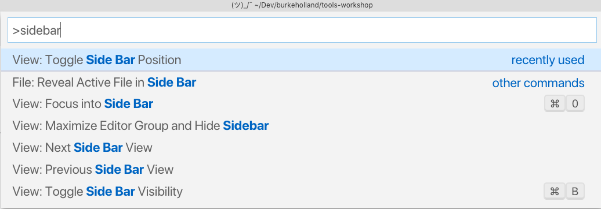
1. Experiment with the new position expanding and collapsing while on a code and notice how the code doesn't jump when the sidebar is on the righthand side.

### Show/Hide Activity Bar

You can hide the Activity Bar for increased real-estate.

1. Open the Command Palette (Cmd/Ctrl + Shift + P) and type "activity"
1. Select "Toggle Activity Bar Visiblity"
   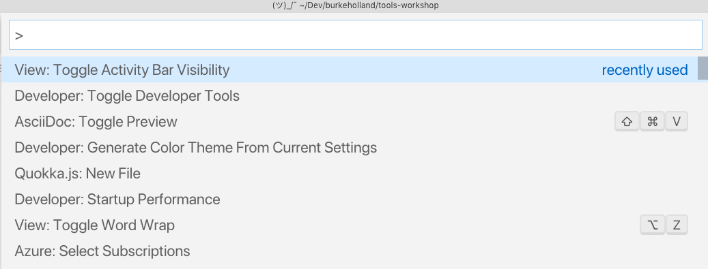
1. You can bind this to a keyboard shortcut so that you don't have to keep opening the command palette to do it.
1. Open the Keyboard Shortcuts configuration (Cmd/Ctrl + K, Cmd/Ctrl + S)
1. Search for "activity"
   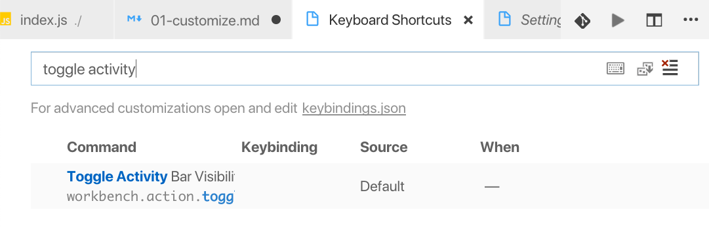
1. Click the plus icon to assign a new keyboard shortcut. I recommend Ctrl + Cmd + B (Ctrl + alt + B on Windows) as it makes it easy to toggle the sidebar (Cmd/Ctrl + B) and then immediately toggle the Activity Bar.

### Change Terminal Position

The terminal can be shown at either the bottom or right-hand side of the editor.

1. Open User Settings (Cmd/Ctrl + ,) and search for "terminal"
1. Change the value from "bottom" to "right"
   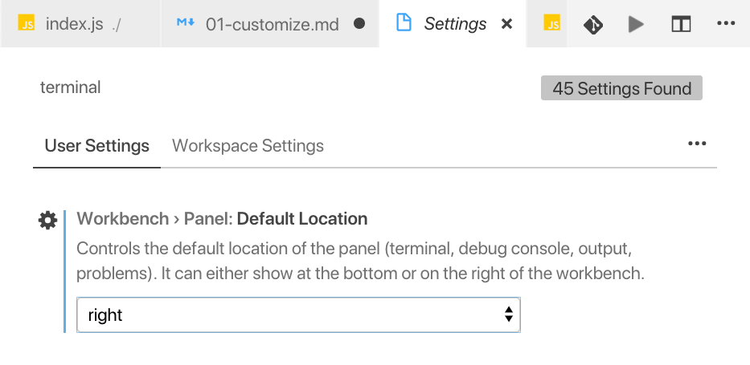
1. Open the terminal (Ctrl + `)

## Fonts

### Enable Font Ligatures

Font Ligatures are a way to represent compound symbols found in programming (==, ===, !=, ect) as a single symbol. To enable them, you need a font that supports ligatures, and then you need to instruct Code to use ligatures.

1. Download the [latest FiraCode release](https://github.com/tonsky/FiraCode/releases) from Github and unzip it
1. Double-click the ttf/FiraCode-Regular.ttf file to install the font on your system
   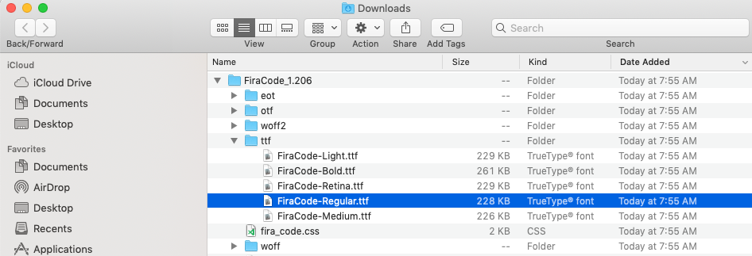
1. Open User Settings (Cmd/Ctrl + ,) and search for "font"
1. Change the "Font Family" to "Fira Code" and make sure that the "Font Ligatures" box is checked.
   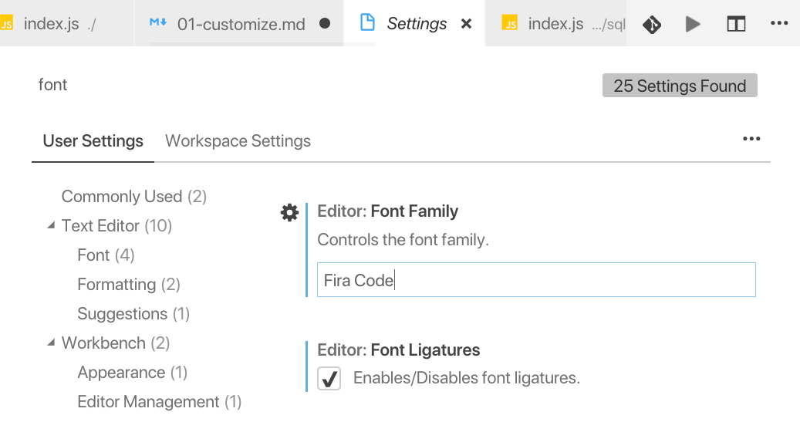
1. Close and reopen Visual Studio Code to get the ligatures to show up
1. Experiment in a code file with compound symbols such as ===, != or =>

Here are a few other visual tweaks that you can experiment with

#### Other Visual Tweaks

##### Modify cursor blink style

1. Open User Settings (Ctrl/Cmd + ,) and search for "cursor".
1. Experiment with "Cursor Blinking", "Cursor Style" and "Cursor Width"
   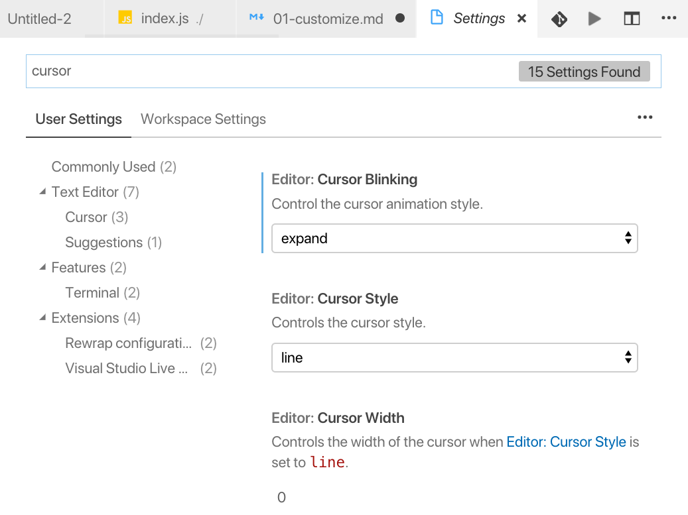

##### Modify Window Title Bar

1. Open user Settings (Ctrl/Cmd + ,) and search for "title"
1. Change the "Window Title". Try different combinations of variables and separators (,|-=). Maybe throw in a little [Ascii Art](https://1lineart.kulaone.com/#/) for good measure.
   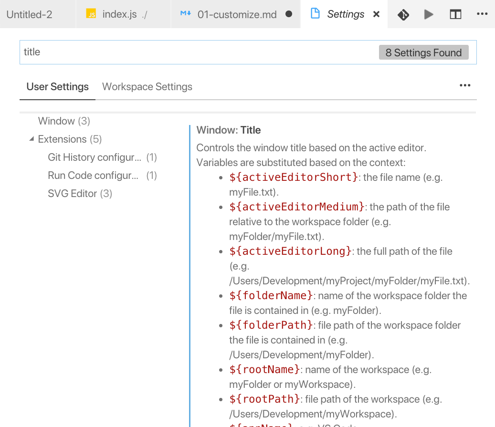

#### Bracket Pair Colorizer

1. Open the Extensions panel (Cmd/Ctrl + Shift + X) and search for "Bracket Pair Colorizer"
   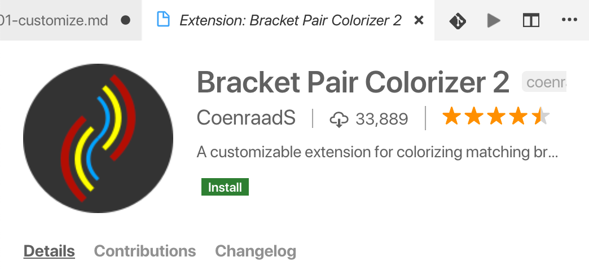
1. Install the extension and reload the editor. Hint: You can reload the editor at any time by opening the Command Palette (Cmd/Ctrl + Shift + P) and selecting "Reload Editor".
1. Examine the index.js file in the projects/sql-reader folder to see how Bracket Pair Colorizer works

#### Enable Breadcrumb Navigation

Breadcrumb Navigation is a way to navigate in the editor with familiar "breadcrumb" style navigation that is most often seen on websites.

1. Open User Settings (Cmd/Ctrl + ,) and search for "breadcrumb"
1. Make sure the "Breadcrumbs: Enabled" box is checked.
   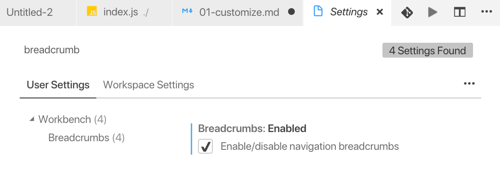
   
#### Emmet Cheat Sheet

Here is the emmet cheat sheet for keys to generate code: [Emmet Cheat Sheet](https://docs.emmet.io/cheat-sheet/)

### BONUS: Create Your Own Color Theme

1. Install vsce (Visual Studio Code Extensions)
1. [Register yourself](https://aka.ms/U8bd2v) as a publisher
1. Ensure that Yoeman and the VS Code project generator are installed
   ```
   npm install -g yo generator-code
   ```
1. Create a new VS Code extension
   ```
   yo code
   ```
1. Select "New Color Theme" from the next menu
1. Select "No, Start Fresh"
1. Enter a name for your theme
1. Enter the same value for the identifier
1. Add a short description
1. Enter your publisher information
1. Enter a publically visible name
1. Designate whether your theme is light, dark or high contrast
1. Open the theme.json file and begin editing your theme
1. Open the Command Palette and select 'Inspect TM Scopes'. These scopes tell you how to target things in the editor.
1. You can also open the developer tools and inspect VS Code itself by opening the Command Palette (Cmd/Ctrl + Shift + P) and selecting "Toggle Developer Tools".
1. Run your theme by pressing "F5"
1. Make changes to your theme project, save, and then click the reload button in the debug bar to reload your theme preview.

#### Get Some Inspiration

You can use other themes to get inspiration for your theme. You can then export that themes settings and re-use them.

1. Select or install a theme you like
1. Open the Command Palette (Cmd/Ctrl + Shift + P) and select "Generate Color Theme From Current Settings"
   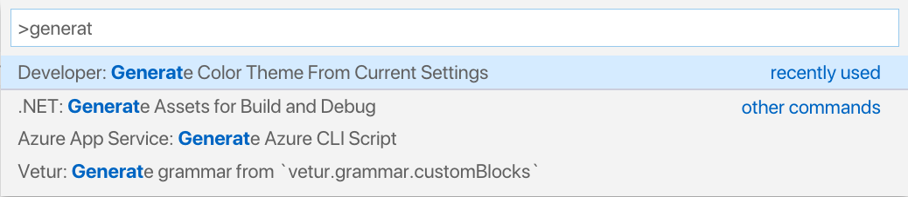
1. Copy the values from that file into your new theme
