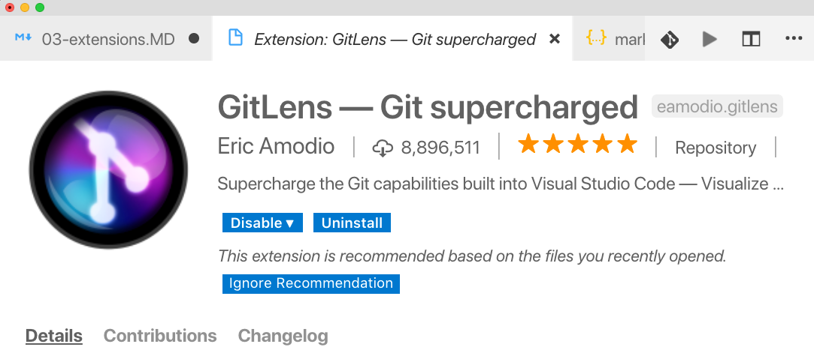
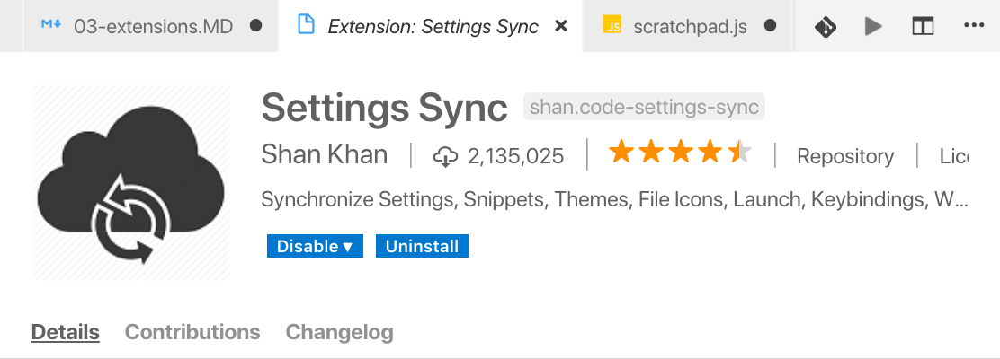

# 03 - VS Code Extensions

## ES Lint

ES Lint is a JavaScript code checker (linter). It comes as a command line tool, but is wrapped as a VS Code extension, which puts ES Lint's output and error hints inside of the editor.

1. Make sure you have ES Lint installed locally. Do that by running...
   ```
   npm install -g eslint
   ```
1. Open the Extensions Explorer (<kbd>Cmd/Ctrl + Shift + X</kbd>) and search for "eslint"
1. Install the ESLint extension from Dirk Baeumer
   
1. Reload the editor
1. Open the embedded terminal and switch to the "projects/sql-reader" project
1. Initialize ESLint in this directory
   ```
   eslint --init
   ```
1. Use the following options for the initialization wizard
   ```
   > How would you like to configure ESLint? Answer questions about your style
   > Are you using ECMAScript 6 features? Yes
   > Are you using ES6 modules? No
   > Where will your code run? Browser
   > Do you use CommonJS? Yes
   > Do you use JSX? No
   > What style of indentation do you use? Spaces
   > What quotes do you use for strings? Single
   > What line endings do you use? Unix
   > Do you require semicolons? Yes
   > What format do you want your config file to be in? JavaScript
   ```
1. Open the "projects/sql-reader/index.js" file
1. Notice all of the red squigglies as ESLint identifies areas of this file that do not conform to the configuration file.
1. Tell ESLint to ignore this file completely by adding the following line to the top of the "index.js" file.
   ```
   /* eslint-disable */
   ```
1. Save the file and notice that all the red lines go away
1. Tell ESLint to ignore the "no-console" rule by adding it to the "eslint-disable" line at the top
   ```
   /* eslint-disable no-console */
   ```
1. Notice that ESLint no longer reports "console" statements as errors
1. Remove the entire "eslint-disable" line at the top
1. Open the .eslintrc.js file
1. Under the "rules" property, add the following line
   ```
   'no-console': 'off'
   ```
1. Save the file and return to the "index.js" file. Notice that ESLint no longer reports "console" statements as errors.
1. Correct the rest of the underlined mistakes from ESLint. Some of this you will do by correcting the code, and some will be done by tweaking the `.eslintrc.js` file. Refer to the [ESLint documentation](https://eslint.org/docs/user-guide/configuring) for help on which settings you can change. **Do Not Correct The Spacing Issue**

## Prettier

Prettier is a code formatter. It works alongside ESLint, but deals more with the actual visual formatting of your code - Line breaks, semi-colons, ect.

1. Open the Extensions Explorer (<kbd>Cmd/Ctrl + Shift + X</kbd>)
1. Type "prettier" in the Extensions Search box
    
1. Open the Command Palette (<kbd>Cmd/Ctrl + Shift + P</kbd>) and select "Format Document"
1. Notice that Prettier formats the document, adding spaces and breaking code at certain places, however the tab issue remains marked up by ESLint. We can configure Prettier to defer to the ESLint configuration and automatically format our document.
1. Open User Settings (<kbd>Cmd/Ctrl + ,</kbd>)
1. Search for "prettier eslint"
1. Check the box for "Pretter: ESLint integration" and save the file
    
1. Open the "projects/sql-reader/index.js" file
1. Open the Command Palette (<kbd>Cmd/Ctrl + Shift + P</kbd>) and select "Format Document"
1. Notice that Prettier fixes all the spacing based on the tab setting specified in the ".eslintrc.js" file

**Bonus**: 

1. Return to User Settings and turn on "Format on Save" which will format documents automatically when they are saved.
1. Install the "Toggle Format on Save" extension to turn "Format on Save" off and on quickly.

## GitLense

1. Open the Extensions Explorer(<kbd>Cmd/Ctrl + Shift + X</kbd>)
1. Search for "git lense"
1. Install the GitLense extension
    
1. Reload the editor
1. Open the "projects/sql-reader/index.js" file
1. Go to line 25 (or whichever line has "console.error")
1. Notice the watermark out to the side
    
1. Hover over the water mark to expand the popup window
    
1. Click the "<<" button in the popup to see a diff of this file.
1. Click on the "GitLense" icon in the sidebar
    
1. Explore the GitLense explorer. Notice that you can view remotes, branches and your local stash. Also notice that this explorer view displays "File History", which shows all of the Git history for the currently selected file in the editor.

## Quokka.js

1. Open the Extensions Explorer(<kbd>Cmd/Ctrl + Shift + X</kbd>)
1. Search for "quokka"
1. Install the Quoakka.js extension
    
1. Sign up for a free Quokka.js account when/if prompted
1. Create a new file in "projects/sql-reader" called "scratchpad.js"
1. Make sure the "scratchpad.js" file is active in the editor and Open the Command Palette (<kbd>Cmd/Ctrl + Shift + P</kbd>) and select "Quokka.js: Start on current file"
1. Add the following code to the file
    ```
    require('console.table');
    console.table([{ name: 'Burke Holland', hair: false }, { name: 'Brian Clark', hair: true }]);
    ```
1. Notice that Quokka adds realtime output in the "Ouptut" panel below
1. Experiment with other commands to see how Quokka.js behaves

## Settings Sync

1. Open the Extensions Explorer(<kbd>Cmd/Ctrl + Shift + X</kbd>)
1. Search for "settings sync"
1. Install the Settings Sync extension
    
1. Follow the [official Settings Sync instructions](http://shanalikhan.github.io/2015/12/15/Visual-Studio-Code-Sync-Settings.html) to configure Settings Sync and upload/download your settings.
1. **Bonus** Make sure you have both VS Code and [VS Code Insiders](https://code.visualstudio.com/insiders/) installed and use Setting Sync to sync both instances together

## JS Framework Extension Packs

1. Open the Extensions Explorer(<kbd>Cmd/Ctrl + Shift + X</kbd>)
1. Install either "React Food Truck", "Angular Essentials" or "Vue VS Code Extension Pack", depending on what framework you are most comfortable with.
1. Create a new React, Angular or Vue file
1. Explorer the various snippets available for these 3 extension packages
1. These extension packages come with other extensions besides snippets. View the README for whichever extension you installed by clicking on the extension name in the sidebar. 
1. Use the Command Palette (<kbd>Cmd/Ctrl + Shift + P</kbd>) to explore the different options for these extensions

## Github Pull Requests

1. Open the Extensions Explorer(<kbd>Cmd/Ctrl + Shift + X</kbd>)
1. Install the "Github Pull Requests" extension
1. Working with PR's requires more than one person, so it's hard to demo in a lab. Instead, check out [this quick video](https://www.youtube.com/watch?v=pa5xHTUXOxQ) from Kenneth Auchenberg from the code team
1. You have any repos on GitHub that have pending PR's, see if you can use the Pull Requests Extension to merge one

## Live Share

1. Open the Extensions Explorer(<kbd>Cmd/Ctrl + Shift + X</kbd>)
1. Install the "VS Live Share" extension
1. Sign into the extension when prompted. If you are not prompted, open the Command Palette (<kbd>Cmd/Ctrl + Shift + P</kbd>) and select "Sign in with Browser".
    
1. Stand by for further instructions... 😉
